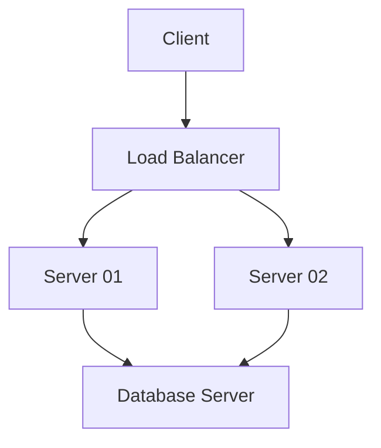
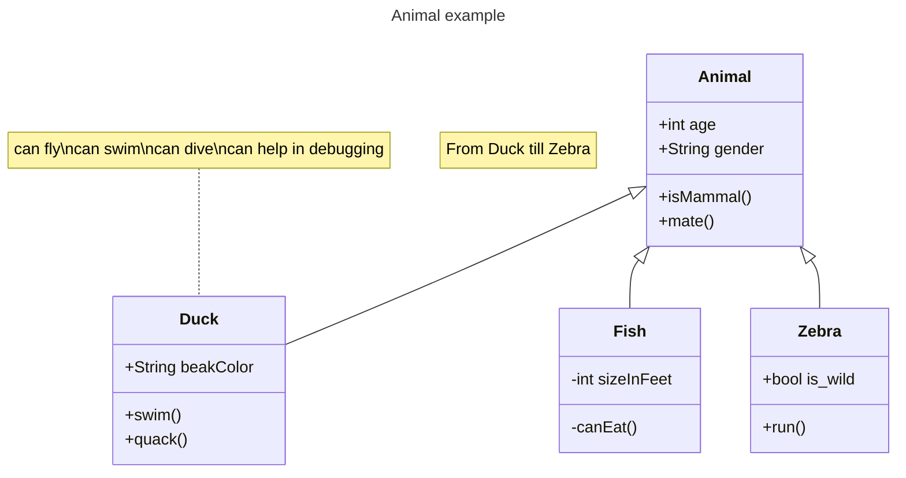
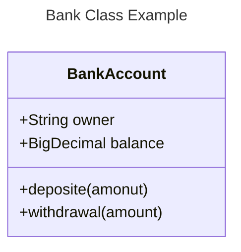
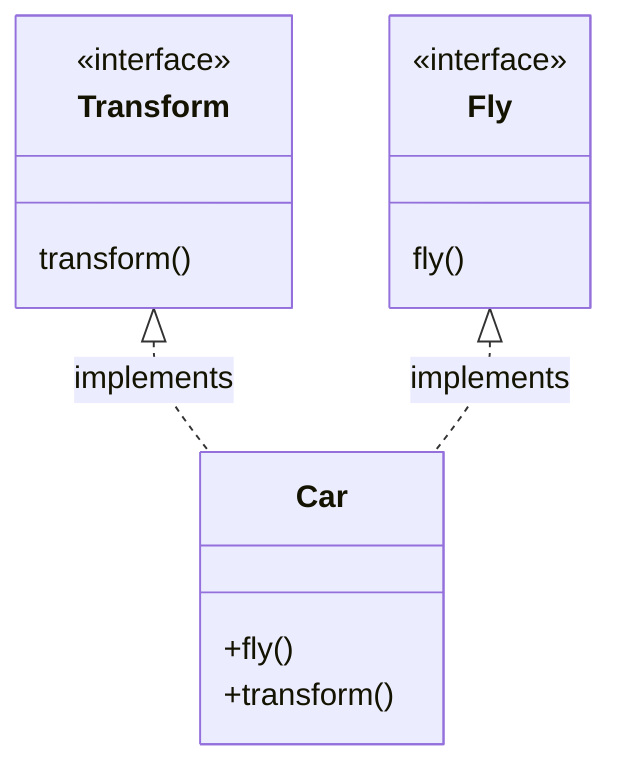
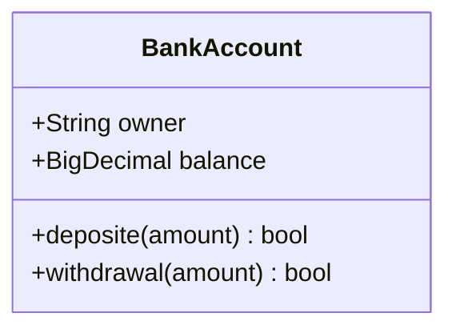
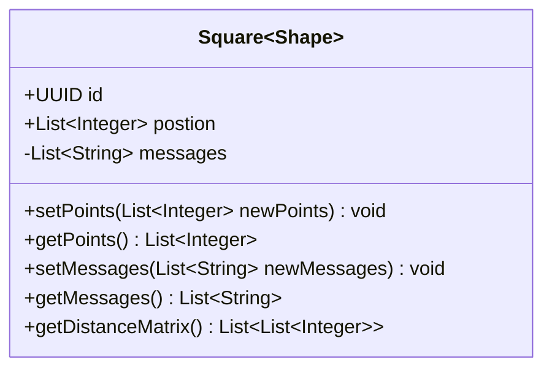
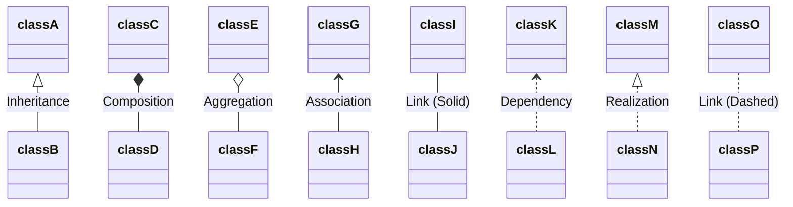
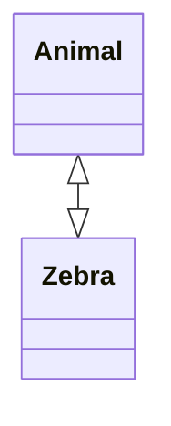
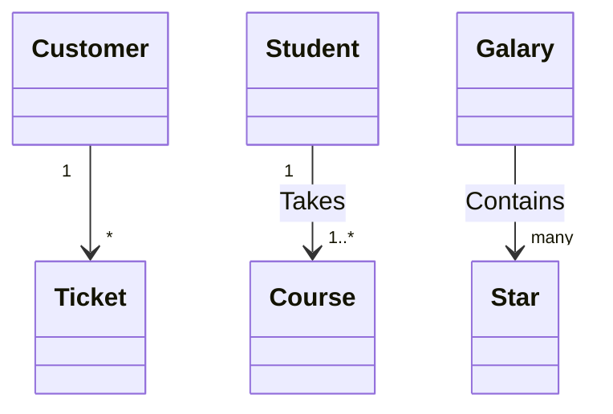

# vue-intro

This template should help get you started developing with Vue 3 in Vite.

## Recommended IDE Setup

[VSCode](https://code.visualstudio.com/) + [Volar](https://marketplace.visualstudio.com/items?itemName=Vue.volar) (and disable Vetur) + [TypeScript Vue Plugin (Volar)](https://marketplace.visualstudio.com/items?itemName=Vue.vscode-typescript-vue-plugin).

## Customize configuration

See [Vite Configuration Reference](https://vitejs.dev/config/).

## Project Setup

```sh
npm install
```

### Compile and Hot-Reload for Development

```sh
npm run dev
```

### Compile and Minify for Production

```sh
npm run build
```

### Lint with [ESLint](https://eslint.org/)

```sh
npm run lint
```

# Mermaid 



# Class Diagrams 



# Code :


# 

```java
public interface Transform {
    void transform();
}

public interface Fly{
    void fly();
}

public class Car{
    public String name; 

    @Override
    public void fly(){
        System.out.println("I can fly");
    }

    @Override
    public void transform(){
        System.out.println("I can Transform");
    }
}
```



# Returned  Types in Methods 



# Generic Types 
* Members can befined using generic types `List<String>` for field parameters and return types by enclosing the types with `~` (tilde)
* Nested types like `List<List<String>>` are supported . 



# Visibility  
To describe the visibility(or Encapsulation) of an attribute or method/function that is a Class member, optional notation may be placed before that class member's name : 
* `+` Public 
* `-` Private 
* `#` Protected 
* `~` Package/Internal 

> **_NOTE:_**  You can also include additional classifiers to a field/method definition by adding the following notations to the end of the name:
>  * `$` Static e.g.:`String someField$`
>  * Abstract e.g.: `someAbstractMethod()*`
>  * Static e.g.: `someStaticMethod()$`

# Defining Relationship

A class relationship is a general term covering the specific types of logical connections found on clsass and object diagras.

[ClassA][Arrow][ClassB]

There are eight different types of relations defined for classes under UML which :

| **Syntax**  | **Description** |
| ----------- | --------------- |
| `<1--`        | Inheritance     |
| `*--`       | Composition     |
| `o--`       | Aggregation     |
| `-->`       | Association     |
| `--`        | Link (Solid)    |
| `..>`       | Dependency      |
| `..1>`      | Realization     |
| `..`        | Link (Dashed)   |




# Two-way relations 

Relations can be logically represent an `N:M` assocation 

## Code :


Here's the Syntax :
[Relation Type ][Link][Relation Type] 

Where `Relation Type` can be out of the following types:

* `<|`  - Inheritence
* `\*` - Composition
* `o` - Aggregation
* `>` - Association
* `<` - Association
* `|>` Realization

And the **Link** can be out of :
* `--` - Solid
* `..` - Dashed 

# Cadinality / Multiplicity on Relations 
Multiplicity or cadinality in class diagrams indicates the number of instances of one class that can be be linked to an instance of of another class.
For example, each company will have one or more employeees(not zero), and each emplyee currently works for zero or one campanies .

Multiplicity notations are placed near the end of an association . 

The different cardinality are :
* `1` Only 1
* `0..1` Zero or One
* `1..*` One or More
* `*` Many 
* `n` n
* `0..n` zero to n
* `1..n` one to n

Cardinality can be easily be defined by placing the text option within the quotoes `"` before or after the a given arrow . For example :
[class A ] "cardinality1" [ Arrow ] "cardinality2" [classB] : LabelText

